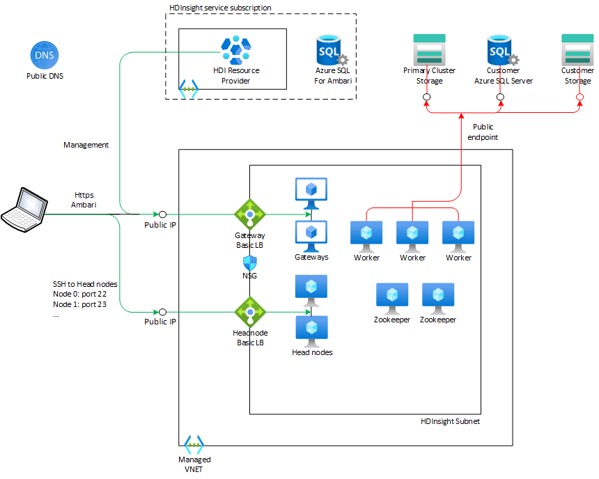
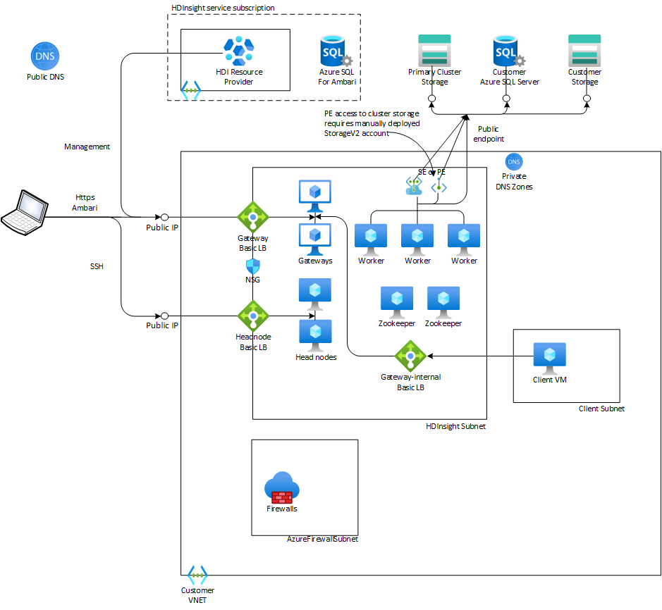
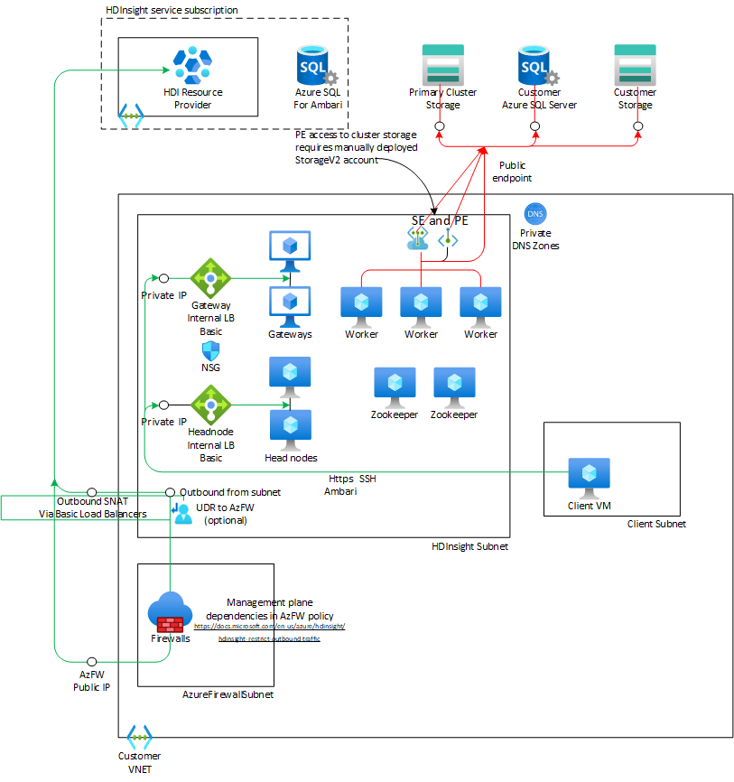
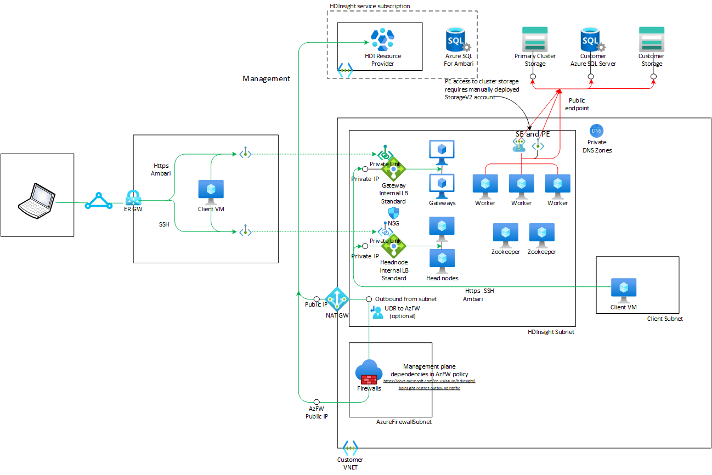

# Networking for Azure Data & Analytics Services - Part 2
This is the second part to the article summarizing networking functionality across Azure Data & Analytics Services. This part covers [HDInsight](https://docs.microsoft.com/en-us/azure/hdinsight/hdinsight-overview), [Azure Databricks](https://docs.microsoft.com/en-us/azure/databricks/scenarios/what-is-azure-databricks) and [Azure Machine Learning](https://docs.microsoft.com/EN-US/azure/machine-learning/overview-what-is-azure-machine-learning). See [Part 1](https://github.com/mddazure/azure-data-services-networking-part-1) for an introduction and details on Azure Data Factory (v2), Purview and Synapse Analytics.

## Contents
  - [Legend](#legend)
  - [HDInsight](#hdinsight)
    - [HDI - Managed VNET](#hdi---managed-vnet)
    - [HDI - Customer VNET, Inbound](#hdi---customer-vnet-inbound)
    - [HDI - Customer VNET, Outbound](#hdi---customer-vnet-outbound)
    - [HDI - Customer VNET, Outbound with Private Link Service](#hdi---customer-vnet-outbound-with-private-link-service)
  - [Databricks](#databricks)
  - [Machine Learning](#machine-learning)

## Legend
In the network diagrams below, arrows indicate the direction of TCP connections. This is not necessarily the same as the direction of flow of information. In the context of network infrastructure it is relevant to show "inbound" versus "outbound" at the TCP level. 

Color coding of flows:
- Green - Control and management.
- Red - Customer data.
- Blue - Meta data of customer data.

## HDInsight
HDInsight is a PaaS platform for big data analytics with open-source frameworks such as Hadoop, Spark, Hive, LLAP, Kafka, Storm, R. Usage scenarios include batch processing for extract, transform and load (ETL) , interactive querying over large amounts of (un)structured data, processing of streaming data in near real time, and data science applications to extract insights from data.

HDInsight runs on VNET-injected compute clusters, either in a Managed VNET or in a customer-owned VNET. Node types and quantities within a cluster depend on the type of the cluster. Generally, clusters consist of worker nodes that do the  distributed data processing, head nodes to control the data processing and Zookeeper nodes to provide synchronization across the distributed applications. Gateway nodes run Ambari, a web-based cluster management and -monitoring interface.

Data in Hadoop is stored in the Hadoop Distributed File System (HDFS), which in a typical on-premise deployment resides on disks attached to the worker nodes. Azure HDInsight separates compute from data. Data is stored in Azure Blob Storage or Azure Data Lake Storage, and HDFS is emulated on the worker nodes.

### HDI - Managed VNET
This is the default configuration. The cluster is placed in a Managed VNET, a dedicated VNET not shared with other customer's clusters but still controlled by the service. The VNET is not visible to the customer and cannot be peered or otherwise connected to the customer's network environment.

:point_right:***Properties***
- The Ambari management portal is accessible over the internet on https://{clustername}.azurehdinsight.net.
- SSH access to the Head Nodes is through {clustername}-ssh.azurehdinsight.net, on port 22 for Node 0 and port 23 for Node 1. A cluster always has two Head Nodes.
- Cluster nodes access external data stores such as Azure SQL and Azure Storage, over public endpoints only. HDInsight does not have Managed Private Endpoints.

### HDI - Customer VNET, Inbound
This configuration places the cluster in a customer-owned VNET, with all nodes connected to the same subnet.

:point_right:***Properties***
- A Public Basic Load Balancer provides inbound access to the Ambari web portal on the Gateway nodes on https://{clustername}.azurehdinsight.net. 
- Another Public Basic Load Balancer, configured with inbound NAT rules, provides ssh access to the Head Nodes on {clustername}-ssh.azurehdinsight.net, on port 22 for Node 0 and port 23 for Node 1.
- An Internal Basic Load Balancer provides access to the Ambari portal on https://{clustername}-int.azurehdinsight.net. Public DNS resolves this FQDN to an IP address in the VNET, it is not accessible from outside the VNET. 
- Inbound access to the cluster can be secured through an NSG on the cluster subnet, but inbound connectivity from the HDInsight management plane on port 443 must be allowed, either [by IP address](https://docs.microsoft.com/en-us/azure/hdinsight/hdinsight-management-ip-addresses#health-and-management-services-all-regions) or by [Service Tag](https://docs.microsoft.com/en-us/azure/hdinsight/hdinsight-service-tags).
- The Headnodes are directly accessible over SSH from VMs in the VNET and in peered VNETs on their private IP addresses. The Headnode Load Balancer does not have a private (VNET) IP address.
- Access from cluster nodes to external data stores can be secured through Service Endpoints attached the cluster subnet, and Private Endpoints. The usual prerequisites, such as for DNS resolution, apply.
- The customer-owned VNET can be peered with other VNETs. However, as Basic Load Balancer is not compatible with Global VNET peeringthe Ambari web portal is only reachable via the Internal Load Balancer from peered VNETs in the same region.
- The VNET can be connected to customer's on-premise locations via ExpressRoute and S2S VPN Gateways.

### HDI - Customer VNET, Outbound
This configuration again places the cluster in a customer-owned VNET, with all nodes connected to the same subnet. Connectivity to the HDInsight resouce provider is now outbound only, initiated from within the cluster. There are no inbound public endpoints on the load balancers or cluster nodes and the cluster is not reachable from the internet.  

:point_right:***Properties***
- No Public IP addresses associated with the cluster, no public inbound access into the cluster.
- Management is through outbound connections from cluster nodes to the HDI Resource Provider only.
- Outbound traffic can be filtered [through Azure Firewall](https://docs.microsoft.com/en-us/azure/hdinsight/hdinsight-restrict-outbound-traffic#configuring-azure-firewall-with-hdinsight). 
(It is technically possible to use a 3rd party NVA, but outbound dependencies are documented in terms of FQDN- and Service Tags. These are only available with Azure Firewall policies).
- A Basic Internal Load Balancer provides private access to the Ambari web portal. 
- A second Basic ILB provides SSH access to the Headnodes through inbound NAT rules, on port 22 for Node 0 and port 23 for Node 1.
- DNS resolution within the VNET (and connected on-premise environment) must be configured to resolve {clustername}.azurehdinsight.net and {clustername}-int.azurehdinsight.net to the Gateway ILB front-end address, and {clustername}-ssh.azurehdinsight.net to Headnode ILB front-end address.

### HDI - Customer VNET, Outbound with Private Link Service
This configuration configures [Private Link Service](https://docs.microsoft.com/en-us/azure/hdinsight/hdinsight-private-link)on the Gateway (Ambari) and Headnode (SSH access) Load Balancers. This enables private connectivity to the cluster through Private Endpoints in VNETs that are not peered or otherwise connected to the HDI Insight VNET.

This configuration uses Load Balancer Standard, as Private Link Service is not available on LB Basic. This blocks outbound access from VMs in its backend pool by default whereas LB Basic permits outbound access. 

Explicit outboud access through NAT Gateway, Azure Firewall or an NVA is therefore a prerequisite. 

Another prequisite is explicitly [disabling `privateLinkServiceNetworkPolicies`](https://docs.microsoft.com/en-us/azure/private-link/disable-private-link-service-network-policy) on the cluster subnet.

:point_right:***Properties***
In addition to the Customer VNET, Outbound configuration:
- Private Link Service is deployed on the Gateway and Headnode Load Balancers and these are now Standard SKU.
- Private access to the Ambari portal and SSH access to the Headnodes is now possible through Private Endpoints in other VNETs that are not peered or otherwise connected to the cluster VNET.
- Direct private access from within the VNET, peered VNETs or on-premise via ExpressRoute or VPN is still possible through the Loab Balancer's private front-end IP addresses. 

:exclamation:The remote VNET must explicitly provide DNS resolution from the cluster FQDNs https://{clustername}.azurehdinsight.net resp. https://{clustername}-ssh.azurehdinsight.net to the Private Endpoint IP addresses. This is not configured automatically for Private Endpoints to Private Link Services.

## Databricks

## Machine Learning