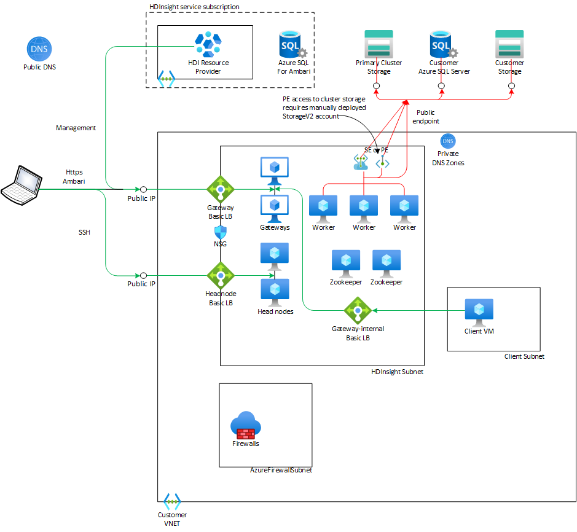
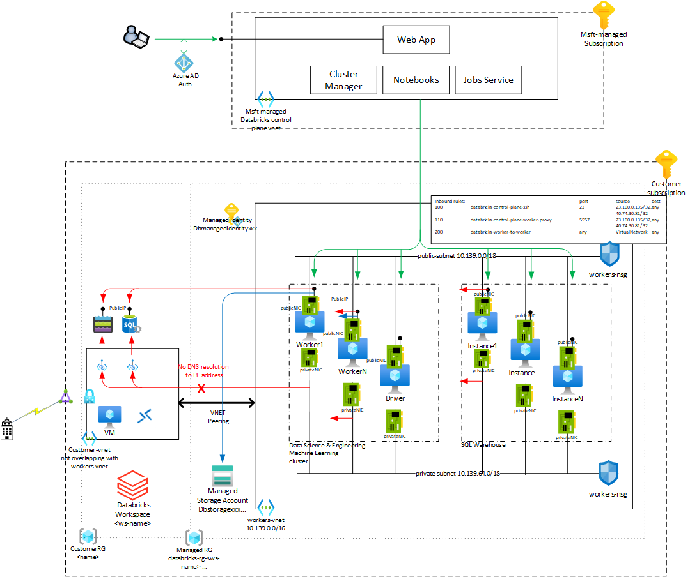
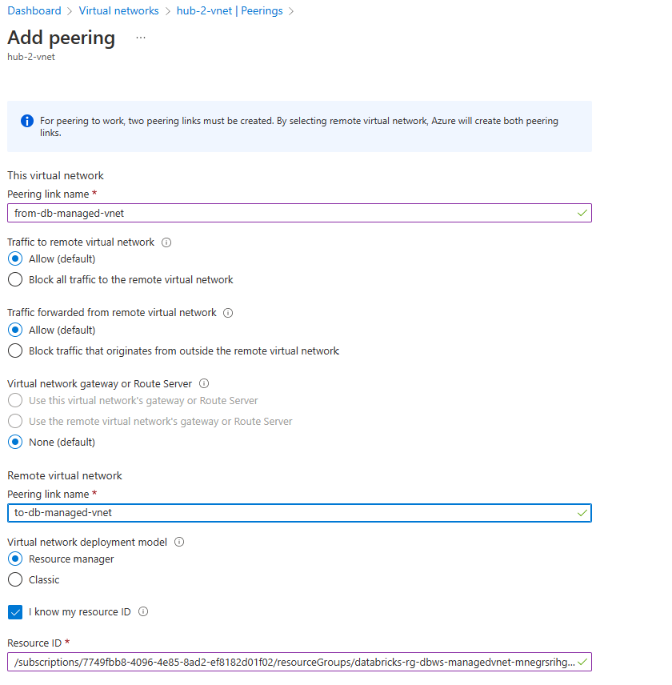

# Networking for Azure Data & Analytics Services - Part 2
This is the second part to the article summarizing networking functionality across Azure Data & Analytics Services. This part covers [HDInsight](https://docs.microsoft.com/en-us/azure/hdinsight/hdinsight-overview), [Azure Databricks](https://docs.microsoft.com/en-us/azure/databricks/scenarios/what-is-azure-databricks) and [Azure Machine Learning](https://docs.microsoft.com/EN-US/azure/machine-learning/overview-what-is-azure-machine-learning). See [Part 1](https://github.com/mddazure/azure-data-services-networking-part-1) for an introduction and details on Azure Data Factory (v2), Purview and Synapse Analytics.

## Contents
  - [Legend](#legend)
  - [HDInsight](#hdinsight)
    - [HDI - Managed VNET](#hdi---managed-vnet)
    - [HDI - Customer VNET, Inbound](#hdi---customer-vnet-inbound)
    - [HDI - Customer VNET, Outbound](#hdi---customer-vnet-outbound)
    - [HDI - Customer VNET, Outbound with Private Link Service](#hdi---customer-vnet-outbound-with-private-link-service)
  - [Databricks](#databricks)
    - [Architecture](#architecture)
    - [Managed VNET](#managed-vnet)
    - [Managed VNET - No Public IP](#managed-vnet---no-public-ip)
    - [VNET Injection](#vnet-injection)
  - [Machine Learning](#machine-learning)

## Legend
In the network diagrams below, arrows indicate the direction of TCP connections. This is not necessarily the same as the direction of flow of information. In the context of network infrastructure it is relevant to show "inbound" versus "outbound" at the TCP level. 

Color coding of flows:
- Green - Control and management.
- Red - Customer data.
- Blue - Meta data of customer data.

## HDInsight
HDInsight is a PaaS platform for big data analytics with open-source frameworks such as Hadoop, Spark, Hive, LLAP, Kafka, Storm, R. Usage scenarios include batch processing for extract, transform and load (ETL) , interactive querying over large amounts of (un)structured data, processing of streaming data in near real time, and data science applications to extract insights from data.

HDInsight runs on VNET-injected compute clusters, either in a Managed VNET or in a customer-owned VNET. Node types and quantities within a cluster depend on the type of the cluster. Generally, clusters consist of worker nodes that do the  distributed data processing, head nodes to control the data processing and Zookeeper nodes to provide synchronization across the distributed applications. Gateway nodes run Ambari, a web-based cluster management and -monitoring interface.

Data in Hadoop is stored in the Hadoop Distributed File System (HDFS), which in a typical on-premise deployment resides on disks attached to the worker nodes. Azure HDInsight separates compute from data. Data is stored in Azure Blob Storage or Azure Data Lake Storage, and HDFS is emulated on the worker nodes.

### HDI - Managed VNET
This is the default configuration. The cluster is placed in a Managed VNET, a dedicated VNET not shared with other customer's clusters but still controlled by the service. The VNET is not visible to the customer and cannot be peered or otherwise connected to the customer's network environment.

:point_right:***Properties***
- The Ambari management portal is accessible over the internet on https://{clustername}.azurehdinsight.net.
- SSH access to the Head Nodes is through {clustername}-ssh.azurehdinsight.net, on port 22 for Node 0 and port 23 for Node 1. A cluster always has two Head Nodes.
- Cluster nodes access external data stores such as Azure SQL and Azure Storage, over public endpoints only. HDInsight does not have Managed Private Endpoints.

### HDI - Customer VNET, Inbound
This configuration places the cluster in a customer-owned VNET, with all nodes connected to the same subnet.

:point_right:***Properties***
- A Public Basic Load Balancer provides inbound access to the Ambari web portal on the Gateway nodes on https://{clustername}.azurehdinsight.net. 
- Another Public Basic Load Balancer, configured with inbound NAT rules, provides ssh access to the Head Nodes on {clustername}-ssh.azurehdinsight.net, on port 22 for Node 0 and port 23 for Node 1.
- An Internal Basic Load Balancer provides access to the Ambari portal on https://{clustername}-int.azurehdinsight.net. Public DNS resolves this FQDN to an IP address in the VNET, it is not accessible from outside the VNET. 
- Inbound access to the cluster can be secured through an NSG on the cluster subnet, but inbound connectivity from the HDInsight management plane on port 443 must be allowed, either [by IP address](https://docs.microsoft.com/en-us/azure/hdinsight/hdinsight-management-ip-addresses#health-and-management-services-all-regions) or by [Service Tag](https://docs.microsoft.com/en-us/azure/hdinsight/hdinsight-service-tags).
- The Headnodes are directly accessible over SSH from VMs in the VNET and in peered VNETs on their private IP addresses. The Headnode Load Balancer does not have a private (VNET) IP address.
- Access from cluster nodes to external data stores can be secured through Service Endpoints attached the cluster subnet, and Private Endpoints. The usual prerequisites, such as for DNS resolution, apply.
- The customer-owned VNET can be peered with other VNETs. However, as Basic Load Balancer is not compatible with Global VNET peeringthe Ambari web portal is only reachable via the Internal Load Balancer from peered VNETs in the same region.
- The VNET can be connected to customer's on-premise locations via ExpressRoute and S2S VPN Gateways.

### HDI - Customer VNET, Outbound
This configuration again places the cluster in a customer-owned VNET, with all nodes connected to the same subnet. Connectivity to the HDInsight resouce provider is now outbound only, initiated from within the cluster. There are no inbound public endpoints on the load balancers or cluster nodes and the cluster is not reachable from the internet.  

:point_right:***Properties***
- No Public IP addresses associated with the cluster, no public inbound access into the cluster.
- Management is through outbound connections from cluster nodes to the HDI Resource Provider only.
- Outbound traffic can be filtered [through Azure Firewall](https://docs.microsoft.com/en-us/azure/hdinsight/hdinsight-restrict-outbound-traffic#configuring-azure-firewall-with-hdinsight). 
(It is technically possible to use a 3rd party NVA, but outbound dependencies are documented in terms of FQDN- and Service Tags. These are only available with Azure Firewall policies).
- A Basic Internal Load Balancer provides private access to the Ambari web portal. 
- A second Basic ILB provides SSH access to the Headnodes through inbound NAT rules, on port 22 for Node 0 and port 23 for Node 1.
- DNS resolution within the VNET (and connected on-premise environment) must be configured to resolve {clustername}.azurehdinsight.net and {clustername}-int.azurehdinsight.net to the Gateway ILB front-end address, and {clustername}-ssh.azurehdinsight.net to Headnode ILB front-end address.

### HDI - Customer VNET, Outbound with Private Link Service
This configuration configures [Private Link Service](https://docs.microsoft.com/en-us/azure/hdinsight/hdinsight-private-link)on the Gateway (Ambari) and Headnode (SSH access) Load Balancers. This enables private connectivity to the cluster through Private Endpoints in VNETs that are not peered or otherwise connected to the HDI Insight VNET.

This configuration uses Load Balancer Standard, as Private Link Service is not available on LB Basic. This blocks outbound access from VMs in its backend pool by default whereas LB Basic permits outbound access. 

Explicit outboud access through NAT Gateway, Azure Firewall or an NVA is therefore a prerequisite. 

Another prequisite is explicitly [disabling `privateLinkServiceNetworkPolicies`](https://docs.microsoft.com/en-us/azure/private-link/disable-private-link-service-network-policy) on the cluster subnet.

:point_right:***Properties***
In addition to the Customer VNET, Outbound configuration:
- Private Link Service is deployed on the Gateway and Headnode Load Balancers and these are now Standard SKU.
- Private access to the Ambari portal and SSH access to the Headnodes is now possible through Private Endpoints in other VNETs that are not peered or otherwise connected to the cluster VNET.
- Direct private access from within the VNET, peered VNETs or on-premise via ExpressRoute or VPN is still possible through the Loab Balancer's private front-end IP addresses. 

:exclamation:The remote VNET must explicitly provide DNS resolution from the cluster FQDNs https://{clustername}.azurehdinsight.net resp. https://{clustername}-ssh.azurehdinsight.net to the Private Endpoint IP addresses. This is not configured automatically for Private Endpoints to Private Link Services.

## Databricks
Azure Databricks is the implementation on Azure of the analytics platform designed by Databricks Inc. (https://www.databricks.com/product/azure). Although based on third party technology, it is a first party Azure-native service. Similar implementations are available in AWS and GCP.

Azure Databricks comprises three service components:

- [Databricks Data Science & Engineering](https://docs.microsoft.com/en-us/azure/databricks/scenarios/what-is-azure-databricks-ws)
This is a "zero-management" implementation of the Apache Spark big data analytics platform, providing fully managed Spark clusters operated through a interactive workspace web portal. It abstracts infrastructure complexity and removes the need for specialized expertise to set up and configure the Spark infrastructure.

- [Databricks Machine Learning](https://docs.microsoft.com/en-us/azure/databricks/scenarios/what-is-azure-databricks-ml)
Databricks Machine Learning is an integrated end-to-end machine learning platform incorporating managed services for experiment tracking, model training, feature development and management, and feature and model serving. 

- [Databricks SQL](https://docs.microsoft.com/en-us/azure/databricks/scenarios/what-is-azure-databricks-sqla)
Environment to run ad-hoc SQL queries on a data lake. 

### Architecture
The architecture of Azure Databricks consists of a control plane and a data plane. 

The control plane runs in an Azure environment owned and managed by the Azure Databricks service. It is represented by the Databricks service element in the Resource Group selected by the customer at when creating the service. The resources it runs on are not visible to the customer. It contains backend services that control the customer's data plane compute clusters, the Databricks web application for the workspace portal and notebooks, and job scheduler. The control plane does not process customer data, with the exception of partial job results for display in notebooks in the web portal. 

The data plane consists of the compute instances that process customer data. It runs in the customer's Azure subscription, in a Resource Group created by the Databricks service. This Resource Group is protected by a Deny assignment permitting only read access and the ability to create Private Endpoint connections to Storage. The data plane accesses customer data in Azure stotage and external sources. The network configuration options available to secure the data plane and the customer's data access are the topic of the sections below.

The Data Science & Engineering and Machine Learning service components share the same compute cluster infrastructure. Clusters are created from the Databricks workspace portal (not the Azure portal).Clusters consist of Linux VMs created from images managed by the Azure Databricks service. These images contain the Databricks Runtime, which includes Apache Spark and tools and libraries. Machine Learning requires an ML-enabled image type to be selected at cluster creation; these image types include the Databricks Runtime for Machine Learning.

Databricks SQL runs on a separate cluster type called SQL Warehouse. This cluster type is inserted into the same network as the Data Science & Engineering and Machine Learning cluster type.

Databricks supports deployment of compute instances in either in a VNET managed by the service, or in a VNET managed by the customer. In both options, all infrastructure is in the same customer subnscription as the Databricks resource. Documentation from Microsoft resp. Databricks describing network deployment option is here [Manage virtual networks](https://learn.microsoft.com/en-us/azure/databricks/administration-guide/cloud-configurations/azure/) and here [Azure Databricks – Bring Your Own VNET](https://www.databricks.com/blog/2019/03/20/azure-databricks-bring-your-own-vnet.html)

### Managed VNET
Compute resources are placed in a VNET controlled by the Databricks service located in the Managed Resource Group. 

The Managed VNET has following non-configurable properties
- Name: workers-vnet
- Address space: 10.139.0.0/16
  - public-subnet: 10.139.0.0/18
  - private-subnet: 10.139.64.0/18
- Network Security Group: workers-nsg on both subnets, contains inbound rules permiting the control plane to access the compoute instances

Cluster compute nodes (Workers) each have two network interface cards (NICs), connected to public-subnet and private-subnet respectively. They have a Public IP on the public NIC; this is used for inbound traffic from the control plane and for outbound traffic to public endpoints of data stores.

The customer can view the workers-vnet, but cannot modify or deploy additional resources into it as it is protected by the Deny assignment on the Managed Resource Group. 

Managed VNET in Databricks does not support Managed Private Endpoints like Azure Data Factory and Synapse Analytics.

The Managed VNET can be peered with a customer VNET, facilitating hybrid connectivity from Databricks compute resources via a VNET Gateway in the customer's VNET. Peering the Managed VNET to a customer VNET is configured from the Databricks blade in the Azure portal, not from the Managed VNET blade. 

This only establishes one half of the peering, the other half must be established from the remote VNET using the Resource ID copied from the dialog box

The remote VNET's IP space cannot overlap with the workers-vnet.

The peered customer VNET can contain Private Endpoints connecting to PaaS services, and these are reachable from the Managed VNET. 

 :point_right: It is not possible to attach a Private DNS Zone to the Managed VNET, nor to modify the VNET's Custom DNS setting. Worker VMs can therefore not resolve PaaS service FQDN's to Private Endpoint private addresses, effectively making it impossible to use Private Endpoints in the peered VNET. If Private Endpoint access to data Paas services is required, use the VNET Injection into Customer VNET pattern. 

:point_right: Outbound traffic from Worker nodes to internet may be routed through Azure Firewall, a Network Virtual Appliance (NVA) or an on-premise internet breakout. However, traffic to the Databricks Control Plane and associated resources must be allowed to flow to the internet directly. UDRs on Worker VM subnets must contain routes with next hop Internet for each of these resources, as described in [User-defined route settings for Azure Databricks](https://learn.microsoft.com/en-us/azure/databricks/administration-guide/cloud-configurations/azure/udr).

### Managed VNET - No Public IP (Secure Cluster Connectivity, SCC)
This option reverses the direction of control plane traffic: cluster compute nodes do not have Public IPs and there are no inbound flows from the control plane into nodes. Control traffic is now outbound from the nodes, via a NAT Gateway instance attached to both public-subnet and private-subnet. This is managed by the Databricks service and cannot be modified.

This configuration is deployed by selecting the No Public IP option in the Networking tab when creating the Databricks workspace. This configuration cannot be changed after the cluster is deployed.

Documentation: [Secure cluster connectivity (No Public IP / NPIP)](https://learn.microsoft.com/en-us/azure/databricks/security/secure-cluster-connectivity)

:point_right: If outbound traffic from workers is routed through a firewall, include UDRs allowing traffic to the control plane to break out to the internet directly, as described in the article linked above.

### VNET Injection into Customer VNET
The cluster is deployed into a VNET in the customer's subscription.

:point_right: This option enables using Private Endpoints to access data sources from Worker nodes.

This configuration is deployed by selecting the VNET option in the Networking tab when creating the Databricks workspace. This configuration cannot be changed after the cluster is deployed.

Documentation: [Deploy Azure Databricks in your Azure virtual network (VNet injection)](https://learn.microsoft.com/en-us/azure/databricks/administration-guide/cloud-configurations/azure/vnet-inject)

### VNET Injection into Customer VNET - No Public IP (Secure Cluster Connectivity, SCC)

Customer VNET Injection can be combined with No Public IP (Secure Cluster Connectivity, SCC). This leverages the customer VNET's egress solution - either VNET default internet access, Load Balancer with Outbound NAT rules or NAT Gateway linked to both workspace subnets.

If outbound traffic from workers is routed through a firewall, ensure that either the firewall allows outbound connectivity to all dependencies, or the UDRs contain routes to let traffic to the control plane and associated resources break out to the internet directly.

, as described in [User-defined route settings for Azure Databricks](https://learn.microsoft.com/en-us/azure/databricks/administration-guide/cloud-configurations/azure/udr).

This configuration is deployed by selecting both the No Public IP and the VNET options in the Networking tab when creating the Databricks workspace. This deploys the .

Documentation: [Egress with VNet injection](https://learn.microsoft.com/en-us/azure/databricks/security/secure-cluster-connectivity#egress-with-vnet-injection)

## Azure Machine Learning